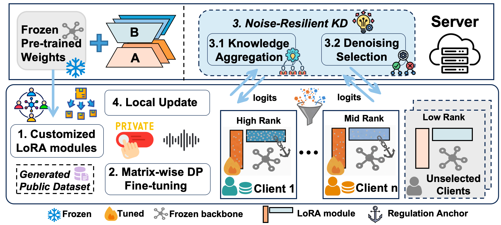
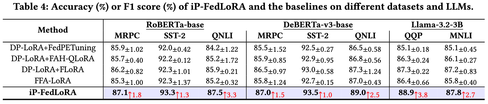

# Efficient and Differentially Private Federated LLM Fine-Tuning on Heterogeneous Clients
[](https://doi.org/10.5281/zenodo.20433736)

> Nan Yan, Yuqing Li, Xiong Wang, Jing Chen, Wei Wang, Kun He, Ruiying Du, and Shuhua Li. *In Proc. SIGKDD 2026*

iP-FedLoRA is a privacy-preserving federated fine-tuning framework for heterogeneous clients. It combines matrix-wise private LoRA fine-tuning, rank-compensated regularization, and noise-resilient knowledge distillation.

## System Architecture



## Folder Structure

```text
iP-FedLoRA/
|-- main.py                     # Training entry point
|-- run.sh                      # Simple experiment launcher
|-- fed_run.sh                  # Distributed launcher
|-- configs/experiments/        # Model and task settings
|-- configs/                    # Argument definitions
|-- data/                       # Data-loading code
|-- models/                     # Model and LoRA code
|-- trainers/                   # Client and server training
|-- fedlab/                     # Federated communication
|-- tools/glue/                 # GLUE data preparation
|-- utils/                      # Shared utilities
```

Datasets and pretrained weights are not included.

## Setup

We recommend Python 3.10 and CUDA 12.1.

```bash
conda create -n ipfedlora python=3.10 -y
conda activate ipfedlora

pip install torch==2.2.1 --index-url https://download.pytorch.org/whl/cu121
pip install -r requirements.txt
```

## Data Preparation

Create the data directories:

```bash
mkdir -p data/glue_tsv data/fedglue
```

Download SST-2, QNLI, QQP, and MNLI:

```bash
curl -L https://dl.fbaipublicfiles.com/glue/data/SST-2.zip -o SST-2.zip
curl -L https://dl.fbaipublicfiles.com/glue/data/QNLI.zip -o QNLI.zip
curl -L https://dl.fbaipublicfiles.com/glue/data/QQP-clean.zip -o QQP.zip
curl -L https://dl.fbaipublicfiles.com/glue/data/MNLI.zip -o MNLI.zip

unzip SST-2.zip -d data/glue_tsv
unzip QNLI.zip -d data/glue_tsv
unzip QQP.zip -d data/glue_tsv
unzip MNLI.zip -d data/glue_tsv
```

Download MRPC:

```bash
mkdir -p data/glue_tsv/MRPC
curl -L https://dl.fbaipublicfiles.com/senteval/senteval_data/msr_paraphrase_train.txt \
  -o data/glue_tsv/MRPC/msr_paraphrase_train.txt
curl -L https://dl.fbaipublicfiles.com/senteval/senteval_data/msr_paraphrase_test.txt \
  -o data/glue_tsv/MRPC/msr_paraphrase_test.txt
curl -L https://dl.fbaipublicfiles.com/glue/data/mrpc_dev_ids.tsv \
  -o data/glue_tsv/MRPC/dev_ids.tsv
```

Generate the federated data files:

```bash
python tools/glue/glue.py \
  --data_dir data/glue_tsv \
  --output_dir data/fedglue
```

## Model Preparation

Install the Hugging Face command-line tool with `requirements.txt`, then download the models:

```bash
mkdir -p pretrain/nlp

huggingface-cli download FacebookAI/roberta-base \
  --local-dir pretrain/nlp/roberta-base

huggingface-cli download microsoft/deberta-v3-base \
  --local-dir pretrain/nlp/deberta-v3-base

huggingface-cli login
huggingface-cli download meta-llama/Llama-3.2-3B \
  --local-dir pretrain/nlp/Llama-3.2-3B
```

Llama-3.2-3B requires access approval from its model provider.

## Reproduction

Run an experiment with one GPU:

```bash
bash run.sh roberta qnli 0
```

Use six GPUs by passing six comma-separated IDs:

```bash
bash run.sh llama mnli 0,1,2,3,4,5
```

Supported combinations:

| Model | Tasks |
|---|---|
| `roberta` | `mrpc`, `sst2`, `qnli` |
| `deberta` | `mrpc`, `sst2`, `qnli` |
| `llama` | `qqp`, `mnli` |

Common parameters can be set from the command line:

```bash
bash run.sh roberta qnli 0 \
  --seed 42 \
  --epsilon 8 \
  --rounds 1 \
  --alpha 5 \
  --sample 0.5 \
  --warmstart-epochs 5 \
  --min-rank 8
```

Use `bash run.sh --help` for all options. Training logs and outputs are saved under `output/`.

The provided settings use supervised public warm-starts and an unnoised task head. Therefore, `epsilon` controls the LoRA perturbation setting and does not represent an end-to-end privacy guarantee.

## Experiment Results

MRPC reports F1 score. The other tasks report accuracy.



## License

This project is released under the Creative Commons Attribution 4.0 International license. See `LICENSE` for details.
